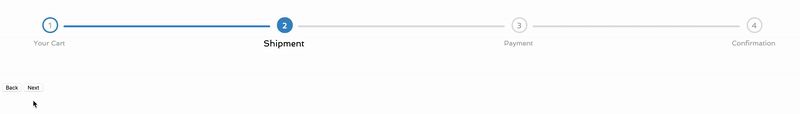
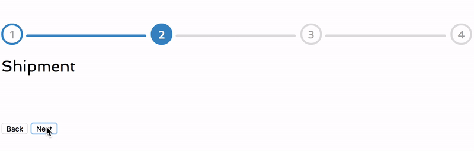

# ResponsiveWizard


A simple CSS library that provide a responsive and customizable wizard header


#### Full Width


#### Responsive


## Installation

```html
  <link rel="stylesheet" type="text/css" href="../css/wizard.min.css">
```

## Usage

Add `done` class for each completed steps.
Add `active` class for the current step.

```html
<ol class="wizard numeric">
	<li class="done">
	   <span> 1 </span>
	   <div>Your Cart</div>
	</li>
	<li class="active">
		<span> 2 </span>
		<div>Shipment</div>
	</li>
	<li>
		<span> 3 </span>
		<div>Payment</div>
	</li>
	<li>
		<span> 4 </span>
		<div>Confirmation</div>
	</li>
</ol>
```

## Customizazion

In order to customize the wizard, just edit the wizard style file.
There two available versions:
* `styl` (Stylus)
* `css`

Edit the one you prefer. :)

## Jquery Plugin (Optional)

This plugin is for dynamically update the wizard through JS code.

### Installation

```html
  <!-- Import JS only if you want to dynamically update the wizard using JS.
      Otherwise you don't need it. -->
  <script type="text/javascript" src="../js/wizard.jquery.js"></script>
```

### Methods

##### Next Step

```js
  $('#element').wizard('nextStep');
```

##### Previous Step

```js
  $('#element').wizard('previousStep');
```
